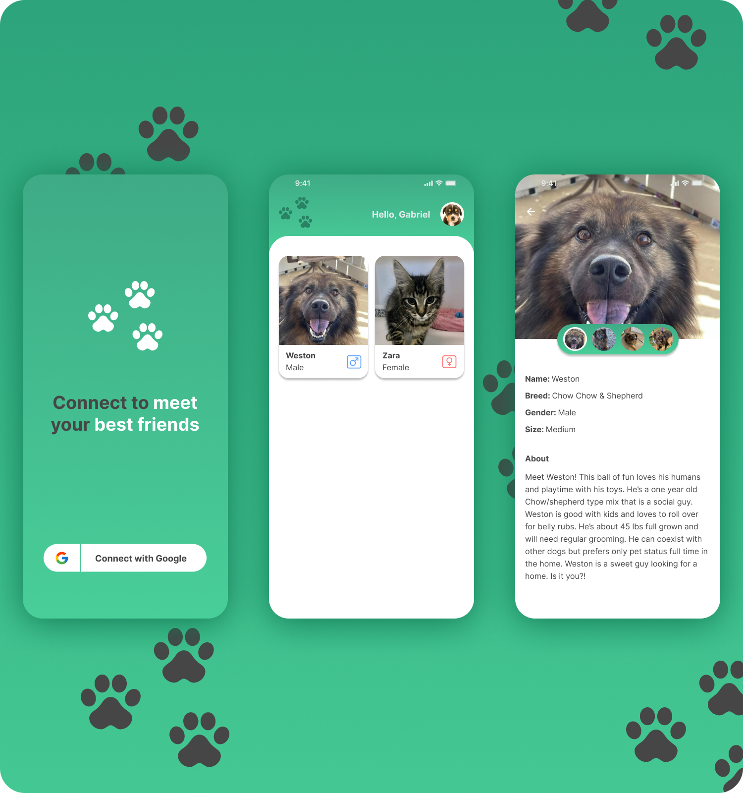

## Give Me Home

##

## 💡 Purpose

This app was made to serve as a portfolio to illustrate my skills and quality of my work. I hope you enjoy it !

## 💻 Project

Give Me Home is a adoption pet app where you can adopt a new friend.

## 🛠️ Features

- [ ] Users can sign in with Google Account;
- [ ] Users can log out;
- [ ] The pet informations are stored on Firestore Cloud;

## ✨ Technologies

- [ ] Flutter
- [ ] Provider
- [ ] Firebase Social Authentication with Google
- [ ] Cloud Firestore
- [ ] Cloud Storage
- [ ] Google fonts
- [ ] Lottie

## 🖍️ Layout

Give Me Home layout is available on Figma. You can access [through this link](https://www.figma.com/file/2ZjGPmThXx4mU9ulBRwjja/Give-Me-Home?node-id=221%3A4).

